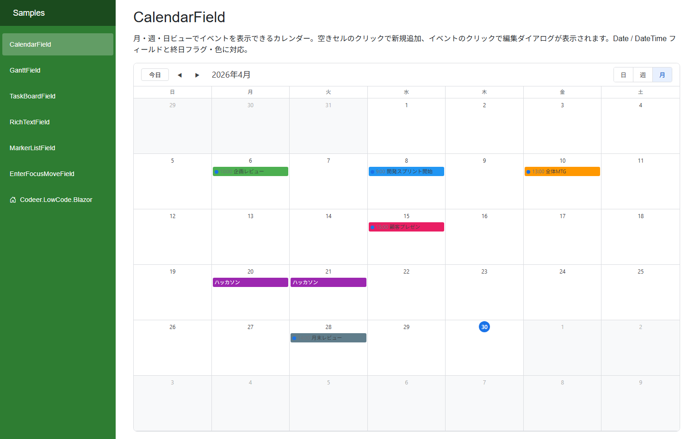

# CalendarField - カレンダー

モジュールデータをカレンダー形式で表示するフィールドです。月・週・日の3つのビューモードに対応しており、イベントの一覧表示、追加、編集が可能です。

## 機能

- **月表示**: 月間カレンダーにイベントを表示
- **週表示**: 1週間のタイムライン上にイベントを表示（終日イベントと時間指定イベントを分離）
- **日表示**: 1日のタイムラインにイベントを詳細表示
- イベントのクリックで編集ダイアログを表示
- 空きセルのクリックで新規イベント追加
- Date型 / DateTime型のどちらにも対応

## デザイナー設定プロパティ

「デザイナ表示名」は Designer (日本語環境) で表示されるラベルです。

| プロパティ | デザイナ表示名 | 型 | 説明 |
|---|---|---|---|
| DisplayName | 表示名 | string | フィールドの表示名 |
| SearchCondition | 検索条件 | SearchCondition | データ取得元のモジュールと検索条件 |
| TextField | テキストフィールド | string | イベントのタイトルとして表示するフィールド (Text型) |
| StartField | 開始フィールド | string | イベントの開始日時フィールド (DateTime型 または Date型) |
| EndField | 終了フィールド | string | イベントの終了日時フィールド (DateTime型 または Date型) |
| AllDayField | 終日フィールド | string | 終日イベントかどうかのフィールド (Boolean型、省略可) |
| ColorField | 色フィールド | string | イベントの色を指定するフィールド (Text型、省略可。CSSカラー値) |
| DetailLayoutName | 詳細レイアウト | string | 編集・追加時に表示するDetailレイアウト名 |
| EnableMonthView | 月表示を有効にする | bool | デフォルト: true |
| EnableWeekView | 週表示を有効にする | bool | デフォルト: true |
| EnableDayView | 日表示を有効にする | bool | デフォルト: true |
| OnDataChanged | データ変更イベント | string | データ変更時に呼び出すスクリプトイベント |

## 必要なモジュール構成

カレンダーに表示するデータを持つモジュールに、以下のフィールドを用意してください。

| 用途 | 必須 | 対応する型 |
|---|---|---|
| タイトル | 必須 | TextField |
| 開始日時 | 必須 | DateTimeField または DateField |
| 終了日時 | 必須 | DateTimeField または DateField |
| 終日フラグ | 任意 | BooleanField |
| 色 | 任意 | TextField (CSSカラー値。例: `#ff0000`, `red`) |

## スクリプトAPI

| メンバー | 種別 | 説明 |
|---|---|---|
| SelectedDate | プロパティ | 現在選択中の日付 |
| ViewMode | プロパティ | 現在の表示モード (CalendarViewMode) |
| Reload() | メソッド | データを再読み込み |
| SetSelectedDate(date) | メソッド | 選択日を変更 |
| SetViewMode(mode) | メソッド | 表示モードを変更 |

### CalendarViewMode

| 値 | 説明 |
|---|---|
| Month | 月表示 |
| Week | 週表示 |
| Day | 日表示 |

## CSS カスタマイズ

カレンダーの見た目はCSSクラスで自由にカスタマイズできます。全CSSクラス一覧とカスタマイズ例は **[CalendarField CSS カスタマイズガイド](CalendarField-CSS-Customization.md)** を参照してください。
