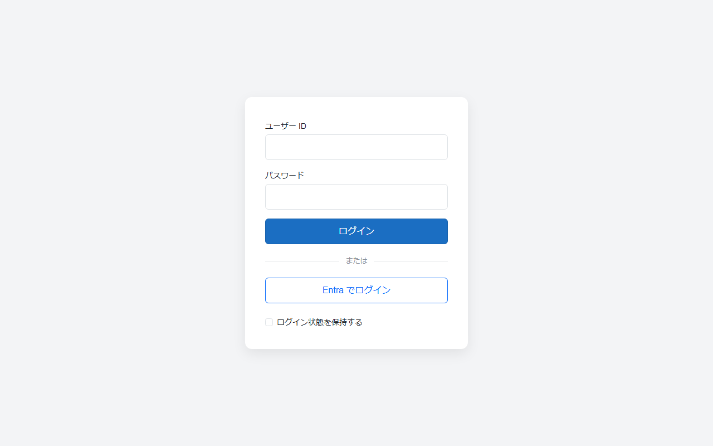

# 外部ログイン (Entra ID / Google / AWS Cognito / OpenID Connect)

`Codeer.LowCode.Blazor.Extras.Server` の `Auth` 名前空間。Cookie 認証のホスト (Starter の Cookie テンプレート) に、
外部 IdP でのサインインを **設定だけで** 足す。

## 考え方

- セッションは常に Cookie。外部 IdP は「本人確認の手段」で、確認できた本人を**アプリのユーザーテーブルの 1 行**に解決してから
  パスワードログインと同じ Cookie を発行する
- したがって認可 (ユーザーモジュール・UserRead/Write 条件・CurrentUser) は認証方式に一切影響されない
- Entra / Google / Cognito / Keycloak / Auth0 / LINE … はすべて OpenID Connect なので、`OidcLoginProvider` (汎用) を土台に、
  種類ごとの実装 (`EntraLoginProvider` / `GoogleLoginProvider` / `CognitoLoginProvider`) が癖 (エンドポイント・クレームの取り方・検証・ログアウト) だけを上書きする。
  製品側にプロバイダ共通の設定型は無く、それぞれ自分の設定クラスを受け取る (メールの `IMailSender`、ファイル保存の `IFileStorage` と同じ構造)
- 独自 IdP は `IExternalLoginProvider` を実装 (多くは `OidcLoginProvider` を継承して一部を上書き) し、テンプレートの対応表 `ExternalLoginTable` に足す
- `ClientId` を書いたプロバイダだけが有効になり、ログイン画面のボタンとチャレンジ URL がそろって現れる。書かなければ何も変わらない

`ClientId` を書いた IdP は、ログイン画面のパスワード入力の下にボタンとして現れる (`AllowPasswordLogin: false` ならボタンだけ、IdP が 1 つなら画面を出さずに遷移)。



## 設定 (appsettings)

IdP の種類ごとに独立したセクション (メールの `Smtp` / `GraphApi`、ファイル保存の `S3Storages` と同じ)。使うものだけ書く。

```json
{
  "AllowPasswordLogin": true,
  "EntraLogin": {
    "ClientId": "<アプリ登録のアプリケーション (クライアント) ID>",
    "TenantId": "<テナント ID>"
  },
  "GoogleLogin": {
    "ClientId": "<OAuth クライアント ID>",
    "AllowedDomains": [ "example.co.jp" ]
  },
  "CognitoLogin": {
    "ClientId": "<アプリクライアント ID>",
    "Authority": "https://cognito-idp.ap-northeast-1.amazonaws.com/ap-northeast-1_XXXXXXXXX",
    "Domain": "https://your-domain.auth.ap-northeast-1.amazoncognito.com"
  },
  "OidcLogins": [
    {
      "Name": "Keycloak",
      "DisplayName": "社内アカウント",
      "ClientId": "lowcodeapp",
      "Authority": "https://idp.example.com/realms/main"
    }
  ],
  "MobileLoginCallbackUrl": "lowcodeapp://auth"
}
```

- `ClientId` を書いたものだけ有効。書かなければ何も変わらない
- **シークレット (`ClientSecret`) はリポジトリに置かない**。user-secrets か環境変数 `EntraLogin__ClientSecret` 等で与える
- `AllowPasswordLogin: false` にすると ID/パスワードのフォームが消え、プロバイダが 1 つならログイン画面を出さずに即 IdP へ遷移する (Entra 専用構成)
- プロバイダ名 (URL `/api/account/login/{名前}`・コールバック `/signin-{名前}`・ログイン画面のボタン) は Entra / Google / Cognito が固定、汎用 OIDC は `Name`

| セクション | 実装 | 主な項目 |
|---|---|---|
| `EntraLogin` | `EntraLoginProvider` | `ClientId` `ClientSecret` `TenantId` (GUID = そのテナントだけ / `organizations` (既定) = 任意の職場アカウント / `common` = 個人アカウントも) `AllowGuests` `AllowedDomains` `DisplayName` |
| `GoogleLogin` | `GoogleLoginProvider` | `ClientId` `ClientSecret` `AllowedDomains` `DisplayName` |
| `CognitoLogin` | `CognitoLoginProvider` | `ClientId` `ClientSecret` `Authority` (必須) `Domain` (ホスト UI。IdP ログアウトに使う) `LoginNameClaim` (既定 email。メール検証オフのプールは `cognito:username`) `AllowedDomains` |
| `OidcLogins[]` | `OidcLoginProvider` | `Name` (必須) `ClientId` `ClientSecret` `Authority` (必須) `Scopes` (既定 openid email profile) `LoginNameClaim` (既定 preferred_username → email → sub。一意・安定が仕様で保証されるのは sub だけなので、ユーザー名に使うクレームは IdP の運用に合わせて決める) `AllowedDomains` `DisplayName` |

## IdP 側の登録

すべてのプロバイダで登録するのは **リダイレクト URI** `https://<ホスト>/signin-<プロバイダ名の小文字>` (例 `https://app.example.com/signin-entra`)。
ログアウト時に IdP のセッションも終わらせるプロバイダは **ログアウト後のリダイレクト URI** も登録する。

| プロバイダ | 登録場所 | リダイレクト URI | ログアウト後 URI | 備考 |
|---|---|---|---|---|
| Entra ID | Entra 管理センター > アプリの登録 > 認証 (Web) | `/signin-entra` | `/signout-entra` | クライアントシークレットは最長 24 か月で失効する。更新手順を運用に組み込む |
| Google | Google Cloud Console > 認証情報 > OAuth クライアント (ウェブ) | `/signin-google` | 不要 (end-session が無い) | 検証済みメールのみ受け付ける |
| AWS Cognito | ユーザープール > アプリクライアント > ホスト UI | `/signin-cognito` | `Domain` を使うなら「許可されているサインアウト URL」に `https://<ホスト>/login.html` | `Authority` は `https://cognito-idp.<region>.amazonaws.com/<UserPoolId>`。メール検証をオフにしているプールは `LoginNameClaim` を `cognito:username` に |
| 汎用 OIDC | 各 IdP | `/signin-<名前の小文字>` | `/signout-<名前の小文字>` | discovery に `end_session_endpoint` があれば IdP ログアウトも行う |

## ホスト側のコード (テンプレートに同梱)

機構はパッケージ、方針はアプリ。アプリが持つのは次の 2 つだけ。

1. **設定** — 上の各セクションを `SystemConfig` に束ねる (Program.cs。メールの Smtp / GraphApi と同じ)。**対応表** (`Services/ExternalLoginTable.cs`) がそれを読んで `IExternalLoginProvider` の一覧にする。独自 IdP はここに 1 行足す
2. **配線** (`CookieAuthentication.cs`)
   ```csharp
   builder.Services.AddAuthentication(CookieAuthenticationDefaults.AuthenticationScheme)
       .AddCookie(...)
       .AddExternalLogins(ExternalLoginTable.Create(), o => o.MobileCallbackUrl = SystemConfig.Instance.MobileLoginCallbackUrl);
   builder.Services.AddScoped<IExternalLoginUserResolver, ExternalLoginUserResolver>();
   ```
3. **ユーザー解決** (`ExternalLoginUserResolver.cs`) — IdP が確認した本人 (`ExternalLoginIdentity`: `LoginName` / `Subject` / `Email` / `DisplayName` / 全クレーム) を
   ユーザーテーブルの 1 行 (`ExternalLoginUser(UserId, UserName)`) にする。テンプレートは **事前登録制** (ユーザーモジュールの `LoginAccountContractField` の ExternalLoginName の列 (空なら LoginName の列) と一致し、IsActive が偽でない行があるときだけ許可。`LoginAccountStore.FindByExternalLoginNameAsync`)。
   自動作成・招待制・`Subject` での紐付けはこのクラスを書き換える。`null` を返すとサインインしない

`AccountController` のエンドポイント (API 契約。login.html はこれを使う参考実装で、ブランディングで自由に触ってよい):

| エンドポイント | 用途 |
|---|---|
| `GET api/account/login_options` | `{ password: bool, providers: [{ name, displayName }] }` |
| `GET api/account/login/{provider}?returnUrl=` | IdP へのチャレンジ (ブラウザ遷移)。`&persistent=true` でブラウザを閉じても残る Cookie (「ログイン状態を保持する」)、`&mobile=true` はネイティブアプリ用 |
| `POST api/account/login_ticket` | ネイティブアプリ: 使い捨てチケットを Cookie に交換 |
| `POST api/account/logout` | `{ redirect }` が返ったらそこへ遷移する (IdP セッションの終了はブラウザ遷移が要るため二段構え)。`?mobile=true` は Cookie 破棄のみ |
| `GET api/account/logout/{provider}` | Cookie 破棄 + IdP ログアウト → `/login.html` |

失敗時は `/login.html?error=<理由>` に戻る: `remote_failure` (IdP 側キャンセル等) / `invalid_claims` / `guest_not_allowed` / `domain_not_allowed` / `user_not_registered`。

## セキュリティ上の既定

- Entra: メールクレームは詐称できるので **UPN (`preferred_username`)** をユーザー名にする。ゲスト (`#EXT#`) は既定で拒否。
  `organizations` / `common` は issuer がテナントごとに違うため `https://login.microsoftonline.com/{GUID}/v2.0` の形式で検証
- Google / Cognito: `email_verified == true` のメールだけ。汎用 OIDC もユーザー名を `email` から取るときは `email_verified == false` を拒否する (クレームを返さない IdP は判定できないので通す)
- `Scopes` に `openid` が無ければ自動で足す (無いと id_token が返らず OIDC として成立しない)
- Authorization Code + PKCE。クレーム名は id_token のまま (`MapInboundClaims = false`)。IdP 側の失敗は詳細を漏らさずログイン画面へ
- Cookie にはパスワードログインと同形の最小クレーム (`Name` / `NameIdentifier`) と経路 (`idp`) だけを積む。IdP のトークンは Cookie の認証プロパティに保持 (ログアウトの `id_token_hint` 用)

## ネイティブアプリ (MAUI)

Web と同じサーバー実装を使う。違うのは「発行された Cookie をアプリに渡す経路」だけ。

1. アプリは `WebAuthenticator` でシステムブラウザに `api/account/login/{provider}?mobile=true` を開く (埋め込み WebView は Google が拒否する)
2. サーバーは通常どおり IdP で本人確認し、Cookie の代わりに使い捨てチケット (既定 2 分・1 回限り) を `MobileLoginCallbackUrl` (`lowcodeapp://auth?ticket=…`) へ返す
3. アプリは `POST api/account/login_ticket` でチケットを Cookie に交換する

テンプレート側: `Services/ServerSettings.LoginCallbackUrl` (appsettings `Server:LoginCallbackUrl`)、Android `WebAuthenticatorCallbackActivity` の `DataScheme`、
iOS `Info.plist` の `CFBundleURLTypes` を同じスキームにそろえる。

## 複数インスタンス (スケールアウト) の注意

チケット (と メール認証コード) の置き場は `IDistributedCache` で、登録はアプリの責任 (テンプレートは `CookieAuthentication.cs` で `AddDistributedMemoryCache()`)。
メモリ実装はプロセス内なので、複数インスタンスでは発行したインスタンスと検証するインスタンスが違うと失敗する。スケールアウトするときは
`AddStackExchangeRedisCache` (Redis) や `AddDistributedSqlServerCache` (SQL Server) に差し替える。Cookie の復号に使う Data Protection の鍵も
インスタンス間で共有されている必要がある (App Service は既定で共有。自前のコンテナ等では `PersistKeysTo...` で共有先を指定する)。

## 導入時に決めること (顧客と)

パッケージでは決められない業務判断。テンプレートの `ExternalLoginUserResolver` に反映する。

- プロビジョニング: 事前登録制 (既定) / 自動作成 / 招待制
- ユーザーの同定キー: ユーザー名 (UPN・メール) で照合するか、`Subject` を紐付けテーブルに持つか (メール変更に強いのは後者)
- 対象アカウント: Entra の対象テナント (`TenantId`)、ゲストの扱い、Google の許可ドメイン
- パスワードログインを残すか (`AllowPasswordLogin`)
- Entra のクライアントシークレット更新の担当と周期
