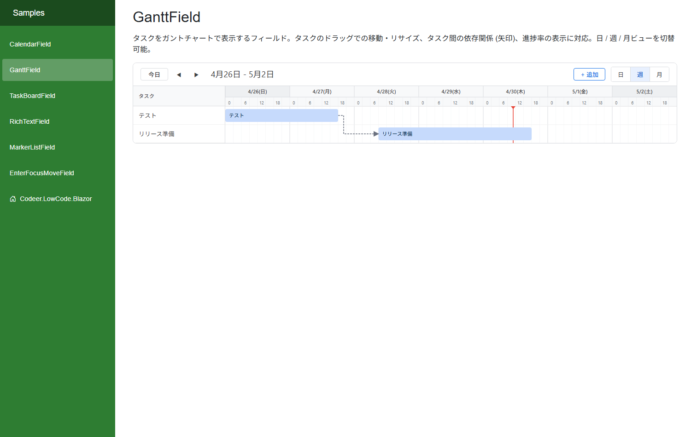

# GanttField - ガントチャート

モジュールデータをガントチャート形式で表示するフィールドです。タスクの期間をバーで可視化し、ドラッグによる移動・リサイズ、タスク間の依存関係の管理が可能です。

## 機能

- **SVGベースのタイムライン描画**: 日・週・月の3つのビューモードとカスタム範囲指定
- **タスクバーのドラッグ操作**: バー全体の移動、左端・右端のリサイズ
- **進捗表示**: バー内に進捗率を視覚的に表示
- **依存関係の管理**: タスク間の依存線を矢印で表示。右クリックメニューから追加、Deleteキーで削除
- **レスポンシブ対応**: コンテナ幅に合わせた自動調整 (FitToWidth)
- Date型 / DateTime型のどちらにも対応

## デザイナー設定プロパティ

「デザイナ表示名」は Designer (日本語環境) で表示されるラベルです。

### タスクモジュール設定 (SearchCondition カテゴリ)

| プロパティ | デザイナ表示名 | 型 | 説明 |
|---|---|---|---|
| DisplayName | 表示名 | string | フィールドの表示名 |
| SearchCondition | 検索条件 | SearchCondition | タスクデータの取得元モジュールと検索条件 |
| TextField | テキストフィールド | string | タスク名として表示するフィールド (Text型) |
| StartField | 開始フィールド | string | タスクの開始日時フィールド (DateTime型 または Date型) |
| EndField | 終了フィールド | string | タスクの終了日時フィールド (DateTime型 または Date型) |
| ProgressField | 進捗フィールド | string | 進捗率フィールド (Number型、0〜100。省略可) |
| IdField | IDフィールド | string | タスクの一意識別子フィールド (Id型) |
| ProcessingCounterField | 処理カウンターフィールド | string | 依存関係の追加/削除時に元タスク・先タスクで +1 されるカウンター (Number型、省略可)。詳細は [ProcessingCounterField の役割](#processingcounterfield-の役割) を参照 |
| DetailLayoutName | 詳細レイアウト | string | 編集・追加時に表示するDetailレイアウト名 |

### 依存関係モジュール設定 (DependenciesModule カテゴリ)

タスク間の依存関係を管理するための別モジュールです。省略可能です。

| プロパティ | デザイナ表示名 | 型 | 説明 |
|---|---|---|---|
| DependenciesModule | 依存関係モジュール | SearchCondition | 依存関係データの取得元モジュールと検索条件 |
| DependencySourceIdField | ソースIDフィールド | string | 依存元タスクIDフィールド (Id型 または Link型) |
| DependencyDestinationIdField | 宛先IDフィールド | string | 依存先タスクIDフィールド (Id型 または Link型) |

### 表示設定

「ビューモード」「表示」「イベント」カテゴリに分かれて表示されます。

| プロパティ | デザイナ表示名 | カテゴリ | 型 | 説明 |
|---|---|---|---|---|
| EnableDayView | 日表示を有効にする | ビューモード | bool | デフォルト: true |
| EnableWeekView | 週表示を有効にする | ビューモード | bool | デフォルト: true |
| EnableMonthView | 月表示を有効にする | ビューモード | bool | デフォルト: true |
| CustomRange | カスタム範囲 | ビューモード | bool | カスタム範囲表示を有効にする (デフォルト: false) |
| CustomRangeEditable | カスタム範囲編集可能 | ビューモード | bool | カスタム範囲の開始・終了日を編集可能にする (デフォルト: true) |
| FitToWidth | 横幅に収める | 表示 | bool | タイムラインをコンテナ幅に合わせる (デフォルト: false) |
| ShowDetailHeader | 詳細ヘッダーを表示 | 表示 | bool | タイムラインの詳細ヘッダーを表示する (デフォルト: true) |
| ShowToolbar | ツールバーを表示 | 表示 | bool | ツールバーを表示する (デフォルト: true) |
| BarColor | バー色 | 表示 | string | バーの色 (CSSカラー値)。空ならフレームワーク既定色 |
| OnDataChanged | データ変更イベント | イベント | string | データ変更時に呼び出すスクリプトイベント |

## 必要なモジュール構成

### タスクモジュール

| 用途 | 必須 | 対応する型 |
|---|---|---|
| タスク名 | 必須 | TextField |
| 開始日時 | 必須 | DateTimeField または DateField |
| 終了日時 | 必須 | DateTimeField または DateField |
| タスクID | 必須 | IdField |
| 進捗率 | 任意 | NumberField (0〜100) |
| 処理カウンター | 任意 | NumberField (依存関係の編集時にタスクに変更を走らせるためのカウンター。詳細は下記) |

### 依存関係モジュール (省略可)

| 用途 | 必須 | 対応する型 |
|---|---|---|
| 依存元タスクID | 必須 | IdField または LinkField |
| 依存先タスクID | 必須 | IdField または LinkField |

## バー色のカスタマイズ

タスクバーの色は `BarColor` で指定します。未指定ならフレームワーク既定色 (薄い青) になります。

### 視覚的な振る舞い

タスクバーは **同じ色を 2 段階の不透明度で塗り分け** ます。

- バー全体: 指定色を `fill-opacity: 0.5` で塗る (未完了領域)
- 進捗オーバーレイ: 指定色を `fill-opacity: 1.0` で塗る (完了領域)
- 文字色: バー色の輝度 (YIQ) から黒系 / 白系を自動算出

これによりバー色を 1 つ指定するだけで「進捗が一目でわかる + 文字も読みやすい」表示になります。

### 色選びのガイドライン

デフォルトのベース色は `#1a73e8` (Material Blue 700) です。`fill-opacity: 0.5` で薄まっても十分視認できる **彩度・明度の高い色** を選ぶと、デフォルトと同じ見た目の質感に揃います。

- 推奨例: `#1a73e8`, `#34a853`, `#ea4335`, `#fbbc04`, `#9334e6` など (Material 系の濃い色)
- 避けたい例: `#e0e0e0` のような低彩度のグレー、`#fce4ec` のようなパステル過ぎる色 (薄まると消えてしまう)

## ProcessingCounterField の役割

`ProcessingCounterField` 自体は楽観ロックフィールドではなく、**フレームワークの楽観ロックを依存関係の変更にも波及させるためのトリガ用カウンター** です。

### なぜ必要か

依存関係 (Dependency) はタスクモジュールではなく別モジュール (`DependenciesModule`) に保存されます。そのため、依存関係だけを追加・削除してもタスクモジュールのレコードは変化せず、タスクに対するフレームワークの楽観ロック (`OptimisticLockingField`) は反応しません。

その結果、同じタスクを A さんが編集中、B さんが依存関係だけ変更して保存 → A さんが保存、というシナリオで、本来検出すべき競合がスルーされてしまいます。

### 仕組み

`ProcessingCounterField` を設定しておくと、依存関係を追加/削除する際に **依存元タスクと依存先タスクの両方の同フィールドが +1** されます。これによりタスク側のレコードに変更差分が発生し、保存時にフレームワークの楽観ロックが他セッションでの並行更新を検出できます。

### モジュール構成

- タスクモジュールに `OptimisticLockingField` (楽観ロックフィールド) を 1 つ
- タスクモジュールに `NumberField` を 1 つ用意し、`ProcessingCounterField` プロパティに指定
- 依存関係モジュールにも必要なら `OptimisticLockingField`

`OptimisticLockingField` が無い構成では `ProcessingCounterField` を設定しても競合は検出されません (単に値が増えるだけです)。

## 操作方法

| 操作 | 動作 |
|---|---|
| バーをドラッグ | タスクの期間を移動 |
| バーの左端/右端をドラッグ | 開始日/終了日を変更 |
| バーをダブルクリック | 編集ダイアログを表示 |
| ツールバーの「+」ボタン | 新規タスクを追加 |
| バーを右クリック | 依存関係の追加メニューを表示 |
| 依存線を選択 → Delete | 依存関係を削除 |

## スクリプトAPI

| メンバー | 種別 | 説明 |
|---|---|---|
| ViewMode | プロパティ | 現在の表示モード (GanttViewMode) |
| Reload() | メソッド | データを再読み込み |
| SetViewMode(mode) | メソッド | 表示モードを変更 |
| SetCustomRange(start, end) | メソッド | カスタム範囲を設定 |

### GanttViewMode

| 値 | 説明 |
|---|---|
| Day | 日単位表示 |
| Week | 週単位表示 |
| Month | 月単位表示 |
| CustomRange | カスタム範囲表示 |

## CSS カスタマイズ

ガントチャートの見た目はCSSクラスで自由にカスタマイズできます。全CSSクラス一覧とカスタマイズ例は **[GanttField CSS カスタマイズガイド](GanttField-CSS-Customization.md)** を参照してください。
