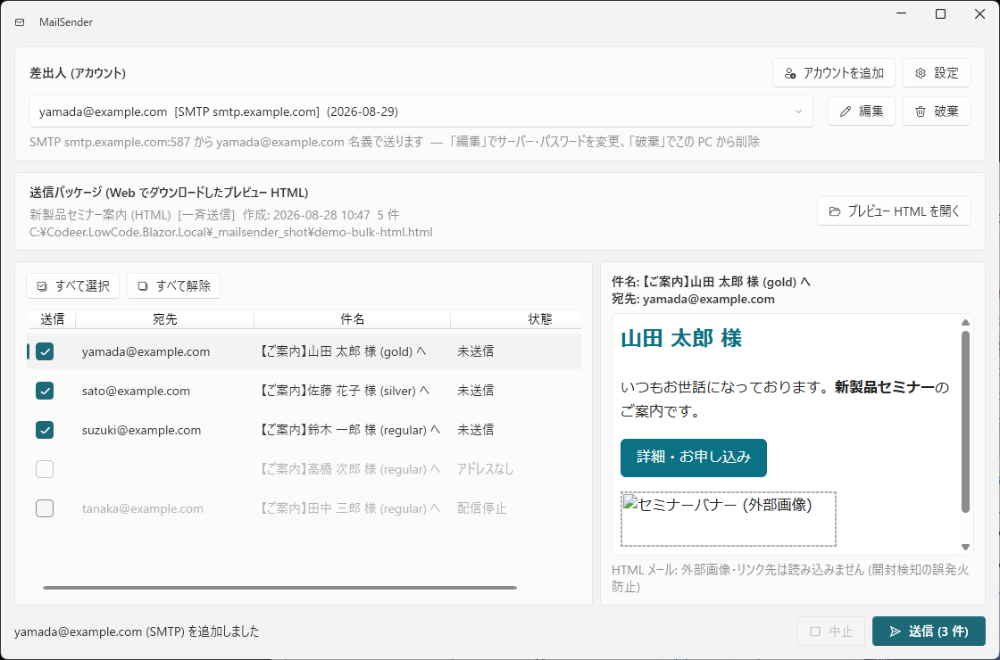
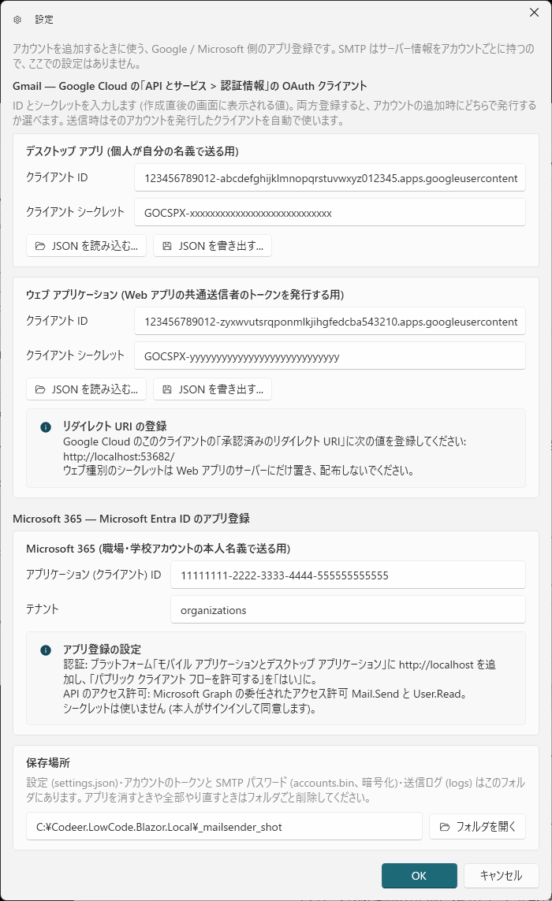
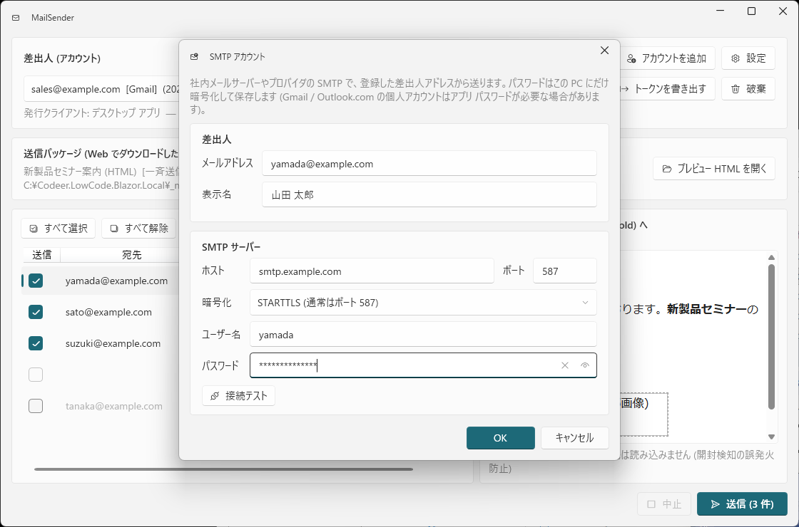
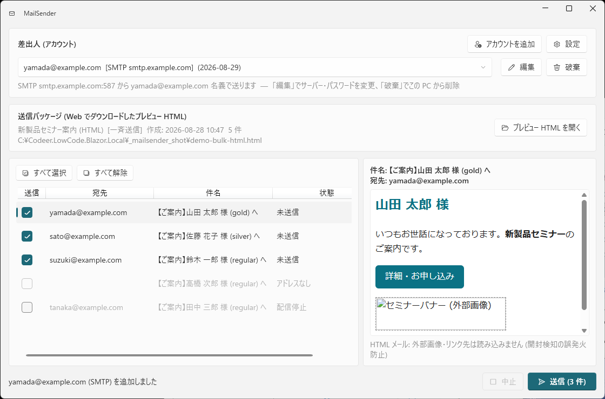
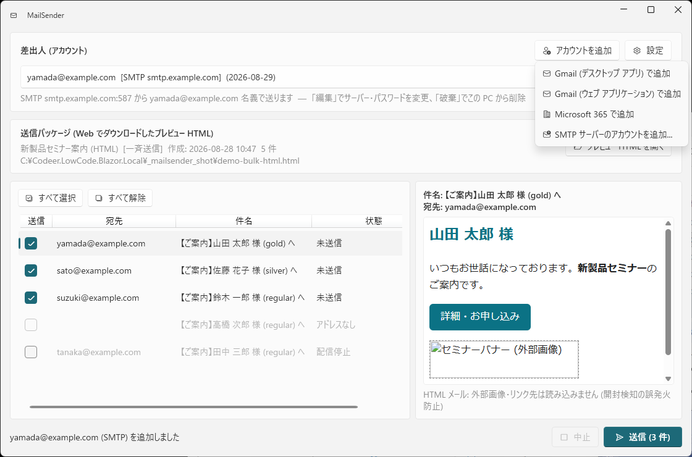

# MailSender — 担当者本人のアカウント名義でメールを送る

[メール送信](Mail.md) (MailField / BulkMailField) の差出人は、通常はサーバーに設定した**システム送信者**です。
**MailSender** は、それを**担当者本人のアカウント名義**で送るための Windows アプリです (`Tools/MailSender`)。
差出人のアカウントは **Gmail** / **Microsoft 365** (Exchange Online) / **SMTP サーバー** から選べます。

- Web アプリの「プレビュー」でダウンロードした HTML を MailSender で開き、内容を確認してから本人のアカウントで送信します
- トークンや SMTP のパスワードは本人の PC にだけ保存され、サーバーには置きません (なりすましの構造的排除と両立させるための設計)
- Web アプリのシステム送信者用の Gmail トークンを発行する管理ツールとしても使います



## 入手方法 (ソースからビルドする)

インストーラや配布パッケージはまだありません。このリポジトリのソースからビルドして、できた exe を使います。
必要なのは **.NET 10 SDK** だけです (Visual Studio は不要)。

1. [.NET 10 SDK](https://dotnet.microsoft.com/download/dotnet/10.0) をインストールする (`dotnet --version` で `10.` 以上が出れば OK)
2. リポジトリを取得して、単一 exe として発行する

   ```
   git clone https://github.com/Codeer-Software/Codeer.LowCode.Blazor.Extras.git
   cd Codeer.LowCode.Blazor.Extras
   dotnet publish Tools\MailSender\MailSender.csproj -c Release -r win-x64 -p:PublishSingleFile=true -o Tools\MailSender\publish
   ```

3. `Tools\MailSender\publish\MailSender.exe` ができます。これ 1 ファイルを任意のフォルダ (例: `C:\Tools\MailSender\`) に置いて起動します。
   組織内で配る場合も、この exe をコピーするだけです

実行に必要なもの (ビルドした PC 以外で動かす場合):

| 必要なもの | 備考 |
|---|---|
| Windows 10 / 11 (64bit) | |
| [.NET 10 デスクトップ ランタイム](https://dotnet.microsoft.com/download/dotnet/10.0) | SDK が入っていれば含まれています。無い PC では起動時にインストールを案内するダイアログが出ます (「.NET Desktop Runtime」の x64) |
| WebView2 ランタイム | HTML メールの本文プレビューに使います。Windows 11 と最近の Windows 10 には同梱済み。無い環境では本文がソース表示になるだけで、送信はできます |

Gmail / Microsoft 365 を使う場合は、初回起動時に「設定」でアプリ登録 (Google の OAuth クライアント / Entra ID のアプリ) の登録が必要です
([事前準備](#事前準備-組織で-1-回) → [使い方](#使い方))。組織内で配る場合は、管理者が 1 つ作ってその ID を利用者に伝えてください
(利用者ごとの作業は不要です)。SMTP サーバーで送る場合は事前準備なしで、アカウントの追加時にサーバー情報を入れるだけです。

## 動作の流れ

```
Web アプリ (MailField / BulkMailField)
    │  「プレビュー」をダウンロード (宛先・件名・本文・添付を含む HTML)
    ▼
MailSender で開く → 宛先ごとに内容を確認 → 送るものにチェック
    │
    ▼
本人のアカウントで送信 (Gmail API / Microsoft Graph / SMTP)。サーバーは関与しない
```

プレビュー HTML はブラウザでそのまま見られる確認用ファイルであり、同時に MailSender の**送信パッケージ**でもあります
(`<script id="data" type="application/json">` に `packageVersion` / `items` の宛先・件名・本文 / `attachmentFiles` / `replyTo` / `isBodyHtml` を持つ)。

## 事前準備 (組織で 1 回)

使う差出人の種類に応じて、Gmail なら Google Cloud、Microsoft 365 なら Entra ID でアプリを登録します (SMTP は不要)。

### Gmail — Google Cloud の OAuth クライアント

1. [Google Cloud コンソール](https://console.cloud.google.com/) でプロジェクトを作り、**Gmail API** を有効にする
2. 「API とサービス > OAuth 同意画面」でアプリ名などを設定する (同意画面に表示される名前はプロジェクトで 1 つ。クライアント名ではありません)
3. 「API とサービス > 認証情報 > OAuth クライアント ID を作成」で、種類 **デスクトップ アプリ** のクライアントを作る
4. 作成直後に表示される **クライアント ID** と **クライアント シークレット** を控える (JSON をダウンロードできる場合はそれでも可)

> デスクトップ種別のクライアント シークレットは、Google の仕様上「秘密として扱わない」ものです (PKCE と併用します)。
> それでも配布物や公開リポジトリには含めないでください。

### Microsoft 365 — Entra ID のアプリ登録

1. [Microsoft Entra 管理センター](https://entra.microsoft.com/) の「アプリの登録」で新規登録する。「サポートされているアカウントの種類」は自組織のみ、または任意の組織 (multitenant) を選ぶ
2. 「認証」→「プラットフォームを追加」→ **モバイル アプリケーションとデスクトップ アプリケーション** を選び、カスタム リダイレクト URI に **`http://localhost`** を追加する。
   同じ画面の「パブリック クライアント フローを許可する」を **はい** にする
3. 「API のアクセス許可」で Microsoft Graph の**委任されたアクセス許可** **`Mail.Send`** と **`User.Read`** を追加する
   (組織の設定でユーザーの同意が許可されていなければ「管理者の同意を与えます」を押す)
4. 「概要」の **アプリケーション (クライアント) ID** を控える。シークレットは作りません (本人がサインインして同意する方式)

> 送ったメールは本人の「送信済みアイテム」に残ります。上限は Exchange Online の受信者レート制限 (1 日 10,000 宛先、1 分 30 通) に従います。

## 使い方

### 1. 設定 (Gmail / Microsoft 365 のみ)

「設定」を開き、Gmail なら「デスクトップ アプリ」欄にクライアント ID とシークレット、Microsoft 365 なら「Microsoft 365」欄にアプリケーション (クライアント) ID を貼って OK を押します。
Google Cloud から JSON をダウンロードした場合は「JSON を読み込む」で取り込めます。
Microsoft 365 の「テナント」は既定 `organizations` (任意の職場・学校アカウント) のままで構いません。個人の Microsoft アカウントも受けるアプリ登録なら `common`、自組織のみなら テナント ID を入れます。



設定・トークン・送信ログは `%LOCALAPPDATA%\Codeer\MailSender\` に保存されます (「フォルダを開く」で開けます)。

| ファイル | 内容 |
|---|---|
| `settings.json` | Gmail の OAuth クライアントの ID / シークレット、Microsoft 365 のアプリケーション ID / テナント、画面の拡大率 |
| `accounts.bin` | 登録したアカウントのトークン・SMTP のサーバー情報とパスワード (Windows の DPAPI で暗号化。同じ PC の同じ Windows アカウントでしか復号できません) |
| `logs\yyyyMMdd.log` | 送信ログ (日時 / 宛先 / 件名 / 結果 / 元ファイル) |

環境変数 `MAILSENDER_DATA_FOLDER` でこのフォルダを差し替えられます (検証用に本番の設定・トークンと分けたいとき)。

### 2. アカウントを追加

「アカウントを追加」を押すと、種類を選ぶメニューが出ます。

- **Gmail (デスクトップ アプリ / ウェブ アプリケーション) で追加** — ブラウザが開き、Google アカウントの選択と許可を求められます。許可するのは「メールの送信 (gmail.send)」とアカウントのメールアドレスの確認だけです
- **Microsoft 365 で追加** — ブラウザが開き、職場・学校アカウントでサインインして「メールの送信」「プロファイルの読み取り」に同意します
- **SMTP サーバーのアカウントを追加...** — 差出人のアドレス・表示名と、SMTP サーバー (ホスト / ポート / 暗号化 / ユーザー名 / パスワード) を入力します。「接続テスト」で接続と認証を確認できます。
  Gmail や Outlook.com の個人アカウントを SMTP で使う場合は、そのサービスの「アプリ パスワード」が必要なことがあります

  

許可 (または OK) するとアプリに戻り、差出人の一覧にそのアカウントが追加されます。複数のアカウントを種類をまたいで登録して、ドロップダウンで切り替えられます。

- ブラウザを途中で閉じてしまった場合は、画面右下の「中止」で待機を抜けられます
- 「再発行」は選択中アカウントのトークンを取り直します (SMTP では「編集」になり、サーバー情報やパスワードを変えられます)。「破棄」はこの PC から削除します (Gmail は Google 側でもトークンを無効化します)
- 再発行・トークンの書き出し・破棄は、いずれも**ドロップダウンで選択中のアカウント**に対して行われます (アドレスの下に対象が表示されます)

### 3. 送信パッケージを開く

Web アプリのメール画面で「プレビュー」を押して HTML をダウンロードし、MailSender の「プレビュー HTML を開く」で開きます
(ウィンドウへのドロップや、ファイルをダブルクリックして「プログラムから開く」でも可)。

- 左に宛先の一覧、右に選択した宛先の件名・本文が表示されます
- 一斉送信で除外された宛先 (配信停止 / アドレスなし) は淡色で表示され、送信対象から外れています
- 「送信」列のチェックで送る宛先を選べます。除外行もチェックを付ければ送れます (アドレスが無い行は不可)

HTML メールの場合は本文を実際の見え方でプレビューします。



> プレビューでは**外部の画像やリンク先を一切読み込みません**。
> SFA/MA などが埋め込む開封検知用の画像を踏んで「開封済み」を誤って記録させないためです (Web アプリ側のプレビュー HTML も同じ動作です)。

### 4. 送信

「送信 (N 件)」を押し、確認ダイアログで差出人を確かめて OK を押すと、チェックした宛先へ 1 通ずつ送信します。
結果は一覧の「状態」列と送信ログに残ります。「中止」で送信中の 1 通が終わったところで止められます。

Gmail の送信上限 (Google Workspace: 2,000 通/日、無料 Gmail: 500 通/日) に達すると、残りは失敗として止まります。
Microsoft 365 は 1 分 30 通の制限に合わせて 2 秒間隔で送ります。SMTP は 1 接続を開いたまま逐次送り、接続できなければ全件失敗になります。
数千通規模の配信はサーバーの配信サービス系インフラで行ってください。

### 画面の拡大縮小

Ctrl + マウスホイールで 70%〜200% に拡大縮小できます。倍率は保存されます。

## Web アプリのシステム送信者のトークンを作る

Web アプリの `Gmail` インフラ (ユーザー同意モード) は、`ClientSecret` に OAuth クライアントの JSON、`TokenSecret` にリフレッシュトークンを設定します
([サーバー設定](Mail.md#サーバー設定-appsettingsjson))。このリフレッシュトークンは MailSender で発行できます。

Web アプリ用には、Google Cloud で種類 **ウェブ アプリケーション** のクライアントを別に作ることを推奨します
(ウェブ種別のシークレットはサーバーにだけ置けます)。デスクトップ種別を共用しても動作します。

1. Google Cloud でウェブ種別のクライアントを作り、「承認済みのリダイレクト URI」に **`http://localhost:53682/`** を登録する。クライアント ID とシークレットを控える
   - リダイレクト URI は、同意フローを実行する MailSender が受けるためのものです。Web アプリ自身は同意フローを実行しない
     (リフレッシュトークンから送信するだけ) ので、Web アプリの URL を登録する必要はありません
2. MailSender の「設定」の「ウェブ アプリケーション」欄に ID とシークレットを貼る。
   「JSON を書き出す」で Web アプリの `Gmail.ClientSecret` 用の JSON (client_secret.json 相当) を保存する
3. 「アカウントを追加」→ メニューで **「ウェブ アプリケーション で追加」** を選び、システム送信者にするアカウントで同意する

   

4. そのアカウントを選んで「トークンを書き出す」→ `{"refresh_token":"..."}` 形式の JSON を保存する (平文なので取り扱いに注意)
5. Web アプリ (Server プロジェクト) の `appsettings.Development.json` または環境変数 (`Gmail__ClientSecret` / `Gmail__TokenSecret`) に設定する

   ```json
   "Gmail": {
     "SenderMailAddress": "noreply@example.com",
     "SenderDisplayName": "サンプル株式会社",
     "ClientSecret": "C:\\secrets\\client_secret_web.json",
     "TokenSecret": "C:\\secrets\\gmail_token_noreply_example.com.json"
   }
   ```

   これらの値は `appsettings.json` に書かずに、git 管理外の `appsettings.Development.json` や環境変数に置いてください。

ウェブ種別で発行したアカウントは一覧に「[ウェブ]」と表示され、同じアドレスをデスクトップ用・ウェブ用の両方で持つことができます。
送信時はそのアカウントを発行したクライアントが自動で使われるので、設定を切り替える必要はありません。

## プロジェクト構成

| フォルダ | 内容 |
|---|---|
| `Tools/MailSender` | WPF アプリ本体 (WPF-UI / WebView2)。Codeer.LowCode.Blazor には依存しない |
| `Tools/MailSender/Codeer.Mail` | 送信部品 (`Gmail/` = Gmail API + Google OAuth、`Graph/` = Microsoft Graph + Entra OAuth、`Smtp/` = MailKit、共通の MIME 組み立て・PKCE・ループバック受信)。UI に依存しないため CLI などに転用できる |

ビルドと発行の手順は [入手方法](#入手方法-ソースからビルドする) のとおりです。成果物 (`publish/`) は git に入れません。

## 関連

- [メール送信](Mail.md) — MailField / BulkMailField / プレビュー / サーバー設定
