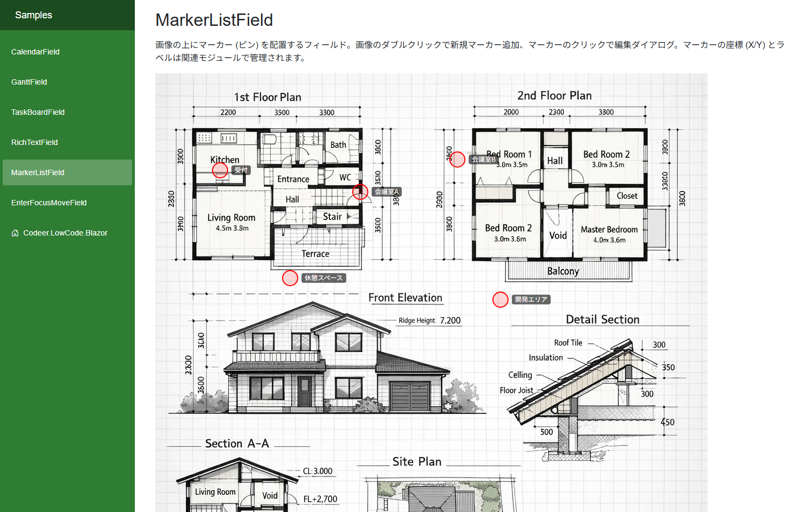

# MarkerListField - 画像マーカー

画像上にマーカー (ピン) を配置して表示するフィールドです。マーカーのクリックや画像上のダブルクリックに対してスクリプトイベントを実行できます。

## 機能

- **画像表示**: リソースパスまたはFileFieldで指定した画像を表示
- **マーカー配置**: SearchConditionで取得したモジュールデータに基づき、画像上の座標にマーカーを配置
- **クリックイベント**: マーカーのクリック、画像上のダブルクリックでスクリプトを実行
- **CRUD操作**: マーカーの追加・編集・削除をダイアログで実行
- **データ永続化**: 変更は親モジュールの保存時にまとめてSubmitされる

## デザイナー設定プロパティ

MarkerListField は現状 DisplayName のローカライズが行われていないため、Designer 上ではプロパティ名 (英語) がそのまま表示されます。

| プロパティ | デザイナ表示名 | 型 | 説明 |
|---|---|---|---|
| ResourcePath | ResourcePath | string | 表示する画像のリソースパス |
| ImageFileField | ImageFileField | string | 画像を持つFileFieldのフィールド名 (ResourcePathの代わりに使用可) |
| SearchCondition | SearchCondition | SearchCondition | マーカーデータの取得元モジュールと検索条件 |
| DetailLayoutName | DetailLayoutName | string | 追加・編集時に表示するDetailレイアウト名 |
| XField | XField | string | マーカーのX座標を持つフィールド (Number型) |
| YField | YField | string | マーカーのY座標を持つフィールド (Number型) |
| LabelField | LabelField | string | マーカーのラベルとして表示するフィールド (Text型、省略可) |
| DefaultMarkerColor | DefaultMarkerColor | string | マーカーの色 (CSSカラー値)。空なら既定色 (赤) |
| OnDataChanged | OnDataChanged | string | データ変更時に呼び出すスクリプトイベント |
| OnClickMarker | OnClickMarker | string | マーカークリック時のスクリプトイベント (引数: `id`) |
| OnDoubleClickPoint | OnDoubleClickPoint | string | 画像ダブルクリック時のスクリプトイベント (引数: `x`, `y`) |

## 画像の指定方法

画像は以下の2つの方法で指定できます。`ImageFileField` が設定されている場合はそちらが優先されます。

| 方法 | プロパティ | 説明 |
|---|---|---|
| リソースパス | ResourcePath | デザイナーでリソースファイルを指定 |
| FileField連携 | ImageFileField | 同一モジュール内のFileFieldから動的に読み込み |

## 必要なモジュール構成

マーカーデータを持つモジュールに、以下のフィールドを用意してください。

| 用途 | 必須 | 対応する型 |
|---|---|---|
| X座標 | 必須 | NumberField |
| Y座標 | 必須 | NumberField |
| ラベル | 任意 | TextField |

## 操作方法

| 操作 | 動作 |
|---|---|
| 画像をダブルクリック | OnDoubleClickPointイベント発火、または新規マーカー追加ダイアログを表示 |
| マーカーをクリック | OnClickMarkerイベント発火、または編集ダイアログを表示 |

## スクリプトAPI

| メンバー | 種別 | 説明 |
|---|---|---|
| Reload() | メソッド | データを再読み込み |

## スクリプトイベント

### OnClickMarker

マーカーをクリックしたときに呼び出されます。設定されていない場合は編集ダイアログが表示されます。

| 引数 | 型 | 説明 |
|---|---|---|
| id | string | クリックされたマーカーのID |

### OnDoubleClickPoint

画像の背景部分をダブルクリックしたときに呼び出されます。設定されていない場合は新規追加ダイアログが表示されます。

| 引数 | 型 | 説明 |
|---|---|---|
| x | int | クリック位置のX座標 (画像内ピクセル) |
| y | int | クリック位置のY座標 (画像内ピクセル) |

## マーカー色のカスタマイズ

マーカーの色は `DefaultMarkerColor` で指定します。未指定なら既定色 (赤) になります。

マーカーは指定色で **枠線を solid + 中身を 15% の同色** に塗ります。CSS の `color-mix()` を使うため、指定色 1 つだけで枠と中身の濃淡が自動で決まります。
