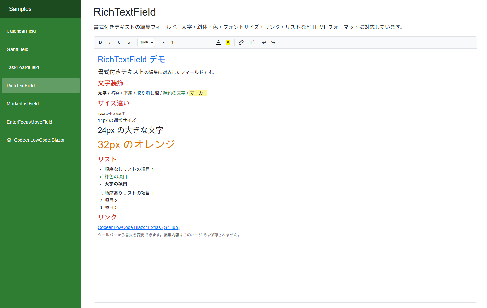

# RichTextField - リッチテキストエディタ

書式付きテキスト (HTML) を編集・保存できる値フィールドです。ツールバーから太字・色・リンクなどの書式を適用できます。

## 機能

- **書式ツールバー**: 太字、斜体、下線、取り消し線
- **見出し設定**: 標準テキスト / H1〜H6 の見出しレベル
- **リスト**: 箇条書きリスト、番号付きリスト
- **テキスト配置**: 左揃え、中央揃え、右揃え
- **文字色 / 背景色**: 16色パレットから選択
- **リンク挿入**: URL指定でハイパーリンクを挿入
- **書式クリア / Undo / Redo**
- **HTML形式で保存**: DBカラムにHTMLテキストとして永続化

## デザイナー設定プロパティ

「デザイナ表示名」は Designer (日本語環境) で表示されるラベルです。

| プロパティ | デザイナ表示名 | 型 | 説明 |
|---|---|---|---|
| DisplayName | 表示名 | string | フィールドの表示名 (`ValueFieldDesignBase` 継承) |
| DbColumn | DBカラム | string | データを保存するDBカラム名 |
| IsRequired | 必須 | bool | true で未入力をバリデーションエラー (`ValueFieldDesignBase` 継承) |
| OnDataChanged | データ変更イベント | string | データ変更時に呼び出すスクリプトイベント (`ValueFieldDesignBase` 継承) |

## 必要なDB構成

HTML文字列を格納するためのテキスト型カラムが必要です。長文を想定する場合は `NVARCHAR(MAX)` や `TEXT` 型を推奨します。

## 表示モード

- **編集モード**: ツールバー付きのエディタを表示。テキストの書式設定が可能
- **閲覧モード**: HTMLをレンダリングして表示。リンクは新しいタブで開く

## スクリプトAPI

| メンバー | 種別 | 説明 |
|---|---|---|
| Value | プロパティ | HTML文字列値の取得・設定 |

## CSS カスタマイズ

リッチテキストエディタの見た目はCSSクラスで自由にカスタマイズできます。全CSSクラス一覧とカスタマイズ例は **[RichTextField CSS カスタマイズガイド](RichTextField-CSS-Customization.md)** を参照してください。
