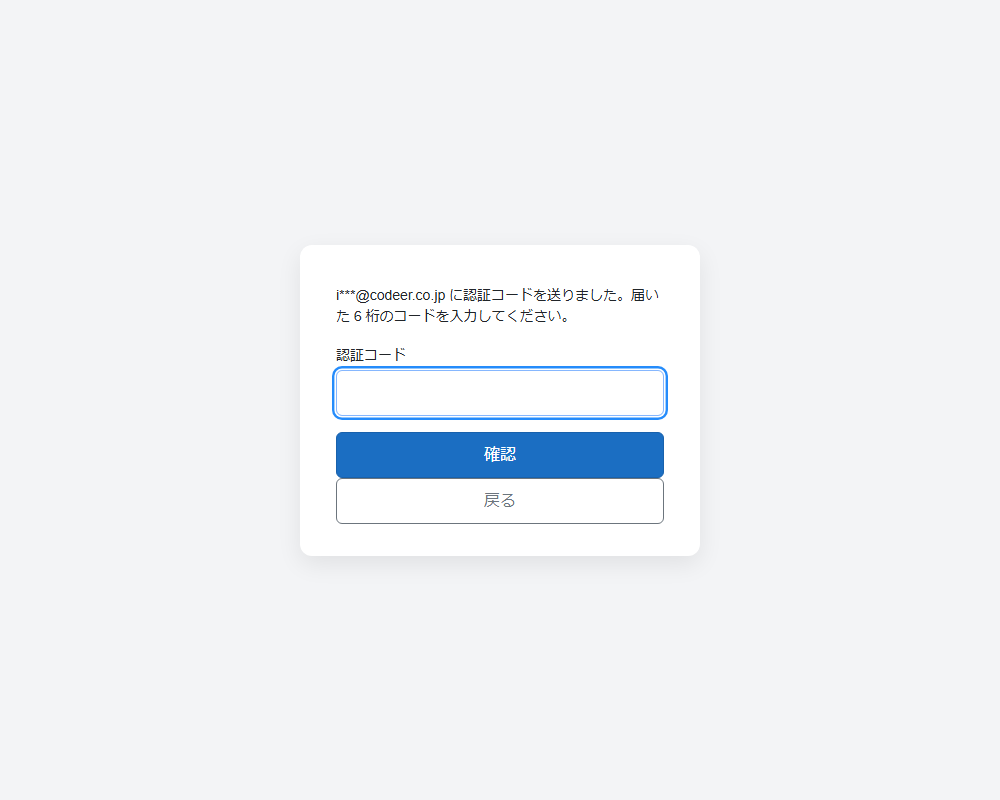

# 二要素認証 (認証アプリ TOTP / メールのワンタイムコード)

`Codeer.LowCode.Blazor.Extras.Server` の `Auth` 名前空間。ID/パスワードのログイン (Starter の Cookie テンプレート) に 2 段階目を足す。方式は 2 つ。

| 方式 | 有効にする方法 | 強度・特徴 |
|---|---|---|
| 認証アプリ (TOTP) | ユーザーモジュールの `LoginAccountContractField` に TOTP の 3 列 (秘密鍵 / 確認済み / 最終タイムステップ) を設定 | RFC 6238 (HMAC-SHA1 / 30 秒 / 6 桁)。初回ログインで QR を登録。オフラインで動く |
| メールのワンタイムコード | ユーザーモジュールの `LoginAccountContractField` の `TwoFactorEmail` に送信先のフィールドを設定 | 6 桁コードをメールで送る。ユーザー側の登録不要で導入が軽い。メールを受け取れる = 本人という前提。列は不要 (コードはサーバーのキャッシュ)。メール送信の設定 (docs/Mail.md) が前提 |

両方あるときは認証アプリが優先される。クライアント (login.html / MAUI の Login.razor) は `POST api/account/login` の応答の `status` で 2 段階目の種類を知る。

## メールのワンタイムコード

パスワードが通ると、伏せ字の送信先とコード入力欄に切り替わる (login.html / MAUI の Login.razor 共通)。



- 有効化: `LoginAccountContractField.TwoFactorEmail` にメールアドレスのフィールドを設定する (それだけ)
- サーバー設定 (appsettings `EmailOtpLogin`、すべて任意): `MailInfraName` (送信インフラの呼び名。空なら `Mail.DefaultInfraName`) / `Subject` (既定 "認証コード: {code}") / `Body` ({code} と {minutes} が置き換わる) / `CodeLifetimeMinutes` (既定 10) / `MaxAttempts` (既定 5。超えるとコード破棄)
- 流れ: パスワード成功 → コードを発行してメール送信 → `status: "email"` と伏せ字の送信先 (`maskedEmail`) を返す → `TwoFactorCode` 付きで再送 → `ok`
- 再送 = パスワードからやり直す (前のコードは無効になる)。同じコードは 1 回だけ。送れなかったときは `send_failed` (サインインしない)
- テンプレートは `MailDispatcher` 経由で送るので、`Mail.DebugRedirectAllTo` (開発環境の宛先リダイレクト) が効く。履歴モジュールには記録しない (コードを残さない)
- コードの置き場は `IDistributedCache` (テンプレートは `CookieAuthentication.cs` で `AddDistributedMemoryCache()`)。複数インスタンスでは Redis 等の共有キャッシュに差し替える (docs/ExternalLogin.md の「複数インスタンスの注意」)

```csharp
// AccountController.Login: パスワード検証の後 (契約に TOTP 列が無いときだけ)
if (accounts.HasTwoFactorEmail)
{
    var email = new EmailOtpLogin(SystemConfig.Instance.EmailOtpLogin, message => CreateMailDispatcher().SendAsync(...), _cache);
    var result = await email.VerifyAsync(account.UserId, account.TwoFactorEmail, loginInfo.TwoFactorCode);
    if (result.Status != EmailOtpLoginStatus.Ok) return Ok(result);   // email / invalid_code / send_failed: サインインしない
}
```

## 認証アプリ (TOTP)

`LoginAccountContractField` の TOTP 列 + `TotpLogin`。オーセンティケータアプリ (Google Authenticator / Microsoft Authenticator 等) の 6 桁コード。RFC 6238 (HMAC-SHA1 / 30 秒 / 6 桁)。QR コードは QRCoder。

## 考え方

- 有効・無効と列の場所は **デザインで決まる**: ユーザーモジュール (`AppSettings.CurrentUserModuleDesignName`) の `LoginAccountContractField` に
  ユーザー行の 3 列 (秘密鍵 / 確認済み / 最終タイムステップ) を設定する。空に戻せば従来のログインに戻る。appsettings に列名の設定は無い
- 3 列は契約の列名だけの宣言 (通常のモジュール読み書きには乗らない)。クライアントに秘密鍵が渡ることはない。
  ユーザーを画面で編集しても列は触られない
- パスワードの検証とサインインはこれまでどおりテンプレートの `AccountController`。パッケージ (`TotpLogin`) は「パスワードが通った後にコードを検証する」部分だけを持ち、
  表・列名はデザインから引いて SQL で直接読み書きする (ログイン時はまだ認証済みユーザーがいないため、パスワード照合と同じ経路)
- 登録は最初のログイン時。パスワードが通ったユーザーに QR を出し、そのコードが合ったときに登録が確定する
- リセットは `MyTotpResetButtonField` (本人用。設定画面などどこにでも置ける) / `TotpResetButtonField` (管理者用。ユーザーモジュールの詳細画面で表示中の行のユーザーを解除。通常の保存と同じ権限で制御) か、3 列を空にする (`TotpLogin.ResetAsync`)

## 使い方

1. ユーザーテーブルに 3 列を足す

   ```sql
   totp_secret        TEXT    NULL,
   totp_confirmed     INTEGER NULL,
   totp_last_timestep INTEGER NULL
   ```

2. デザイナでユーザーモジュールの `LoginAccountContractField` に 3 列を割り当てる ([契約の説明](../Source/Codeer.LowCode.Blazor.Extras.Designer/FieldDocs/LoginAccountContractFieldDesign.md))

3. 任意: appsettings でオーセンティケータに表示するアプリ名を変える (既定 "LowCodeApp")

   ```json
   { "TotpLogin": { "Issuer": "社内ポータル" } }
   ```

## ログインの流れ (API 契約)

`POST api/account/login` が 2 段階になる。1 段階目は `{ Id, Password }`、2 段階目は同じものに `TwoFactorCode` を足して送る。
応答は `{ status, secret?, otpauthUri?, qrPngBase64?, maskedEmail? }`。

| status | 意味 | クライアントの動き |
|---|---|---|
| `setup` | (認証アプリ) パスワードは正しいが未登録 | QR (`qrPngBase64`) と手入力用の鍵 (`secret`) を表示し、コードを入力させて `TwoFactorCode` 付きで再送 |
| `totp` | (認証アプリ) パスワードは正しく登録済み | コードを入力させて `TwoFactorCode` 付きで再送 |
| `email` | (メール) コードを送った | 送信先 (`maskedEmail`) を案内し、コードを入力させて `TwoFactorCode` 付きで再送 |
| `invalid_code` | コード不一致 (期限切れ・同じコードの再利用・試行超過を含む) | 入力し直し |
| `send_failed` | (メール) 送れなかった | 管理者に連絡するよう案内 |
| `ok` | サインイン済み | アプリへ |

二要素認証が無効なときも応答は `{ status: "ok" }` (以前の空応答から変わっている。login.html / MAUI の Login.razor は両方を受け付ける)。

テンプレート側のコード (同梱ソース):

```csharp
// AccountController.Login: パスワード検証の後
var totp = TotpLogin.Create(designData, SystemConfig.Instance.TotpLogin, _dataService.DbAccess);   // 契約に TOTP 列が無ければ null
if (totp != null)
{
    var result = await totp.VerifyAsync(account.UserId, account.LoginName, loginInfo.TwoFactorCode);
    if (result.Status != TotpLoginStatus.Ok) return Ok(result);   // setup / totp / invalid_code: サインインしない
}
```

## リセット (認証アプリの登録の解除)

端末の紛失・機種変更のときは登録を解除します。解除すると次回ログイン時に QR から再登録になります (弱くなる方向ではありません)。どちらのボタンも確認ダイアログ付きです。

| フィールド | 使う人 | 置き場所 | 対象 |
|---|---|---|---|
| TotpResetButtonField (認証アプリ解除ボタン) | 管理者 | ユーザーモジュールの詳細画面 | 表示中の行のユーザー |
| MyTotpResetButtonField (自分の認証アプリ解除ボタン) | 本人 | 設定画面・マイページなど、どのモジュールにも置ける | ログイン中の自分 |

### TotpResetButtonField (管理者用)

解除は「TOTP の 3 列を空にする」データを持った**通常の保存**です。そのためモジュールの UserWriteCondition / 行の DataWriteCondition がそのまま効き (その行を編集できる人だけが解除できる)、サーバーに専用の API はありません。

- ボタンを押すとモジュール全体が保存されます。編集中の他のフィールドも一緒に保存されます
- 新規行 (ユーザーがまだ無い) では表示されません
- 3 列は書き込み専用なので、秘密鍵はクライアントに来ず、登録済みかどうかも表示しません (ボタンだけ)

| プロパティ | デザイナ表示名 | 型 | 説明 |
|---|---|---|---|
| Text | ボタンの文字 | string | 空なら「認証アプリを解除」 |
| ConfirmMessage | 確認メッセージ | string | 解除前の確認メッセージ。空なら既定の文言 |
| DbColumnTotpSecret | 認証アプリ: 秘密鍵列 | string | 秘密鍵の列 (書き込み専用。解除で NULL) |
| DbColumnTotpConfirmed | 認証アプリ: 確認済み列 | string | 確認済みの列 (書き込み専用。解除で 0) |
| DbColumnTotpLastTimestep | 認証アプリ: 最終タイムステップ列 | string | 最終タイムステップの列 (書き込み専用。解除で 0) |

3 列は同じモジュールの `LoginAccountContractField` の TOTP 列と**同じ値**にしてください。サーバーのログイン処理が見るのは契約の列なので、ボタンが別の列を空にしても解除になりません。デザインチェックが次を指摘します。

- `TotpResetButtonFieldDesign:1` — ログインユーザーモジュール (`AppSettings.CurrentUserModuleDesignName`) 以外に置いている
- `TotpResetButtonFieldDesign:2` — 3 列のどれかが契約の列と違う (同じモジュールに契約が無い・契約に TOTP 列が無いときも指摘される)

### MyTotpResetButtonField (本人用)

登録済みなら「認証アプリ: 登録済み」と解除ボタン、未登録なら「認証アプリ: 未登録」だけを表示します。アプリで認証アプリの二要素認証を使っていない (契約に TOTP の列が無い) ときは何も表示しません。状態は表示時にサーバーへ問い合わせます。

| プロパティ | デザイナ表示名 | 型 | 説明 |
|---|---|---|---|
| Text | ボタンの文字 | string | 空なら「認証アプリを解除」 |
| ConfirmMessage | 確認メッセージ | string | 解除前の確認メッセージ。空なら既定の文言 |

### スクリプト

| フィールド | メンバー | 説明 |
|---|---|---|
| TotpResetButtonField | `Reset()` | 確認の後、表示中の行のユーザーの登録を解除してモジュールを保存する。成功なら true |
| MyTotpResetButtonField | `Reset()` | 確認の後、自分の登録を解除する。成功なら true |
| MyTotpResetButtonField | `IsRegistered` | 自分が登録済みか (bool?)。未取得・機能無効なら null |

### サーバー API と結線 (MyTotpResetButtonField)

Starter の Cookie テンプレートの `AccountController` に組み込み済みです。対象は常にログイン中のユーザーです。

| API | 内容 |
|---|---|
| `GET api/account/totp/status` | 状態 `{ Enabled, Registered }` を返す (`Enabled` = 契約に TOTP 列がある) |
| `POST api/account/totp/reset` | 自分の 3 列を空にし (`TotpLogin.ResetAsync`)、解除後の状態を返す |

```csharp
// AccountController (どちらも [Authorize])
[HttpGet("totp/status")]
public async Task<IActionResult> GetTotpStatus()
{
    var totp = TotpLogin.Create(DesignerService.GetDesignData(), SystemConfig.Instance.TotpLogin, _dataService.DbAccess);
    if (totp == null) return Ok(new TotpStatus());
    var current = await totp.FindAsync(DataService.GetCurrentUserId(HttpContext));
    return Ok(new TotpStatus { Enabled = true, Registered = current?.IsConfirmed == true });
}

[HttpPost("totp/reset")]
public async Task<IActionResult> TotpReset()
{
    var totp = TotpLogin.Create(DesignerService.GetDesignData(), SystemConfig.Instance.TotpLogin, _dataService.DbAccess);
    if (totp == null) return NotFound();
    await totp.ResetAsync(DataService.GetCurrentUserId(HttpContext));
    return Ok(new TotpStatus { Enabled = true, Registered = false });
}
```

クライアントは起動時にエンドポイントを設定します (テンプレートは `ServiceInitializer`)。未設定のときは状態が取れないので、ボタンは何も表示しません。

```csharp
using Codeer.LowCode.Blazor.Extras.Fields;

TotpResetClient.StatusEndPoint = "/api/account/totp/status";
TotpResetClient.ResetEndPoint = "/api/account/totp/reset";
```

## 検証の既定

- 照合窓は現在時刻 ±1 ステップ (30 秒ずれまで許容)
- 一度成功したタイムステップ以下のコードは受け付けない (リプレイ防止)
- 登録が確定するまでは同じ鍵で QR を再表示する (途中で閉じても登録し直しにならない)
- 未登録のユーザーがコードだけ送っても鍵は作らない

## 割り切りと補い方

- **初回ログイン時の登録**: パスワードだけを知る第三者が先に登録できる余地がある。許容できない運用では、初回ログインを管理者立ち会いで行う等で補う
- 試行回数制限・リカバリーコードは持たない。必要なら前段 (リバースプロキシ等) か AccountController で足す
- 時刻ずれはサーバーと端末の時計に依存する。サーバーは NTP で合わせておく

## ネイティブアプリ (MAUI)

同じ API を使う。テンプレートの `Pages/Login.razor` は `setup` / `totp` を受けるとコード入力に切り替わり、`setup` では QR を表示する。
